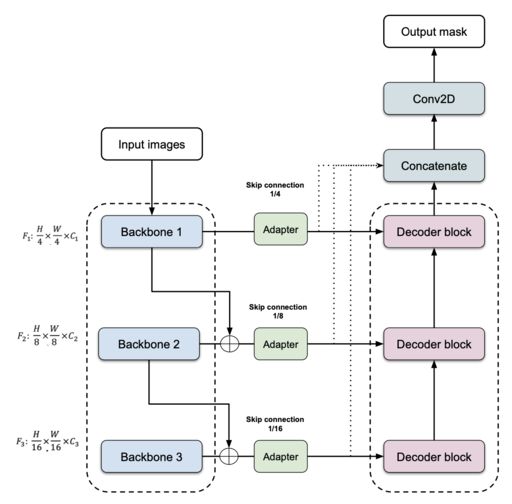
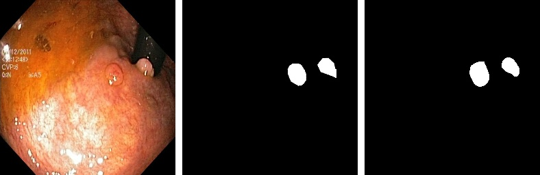
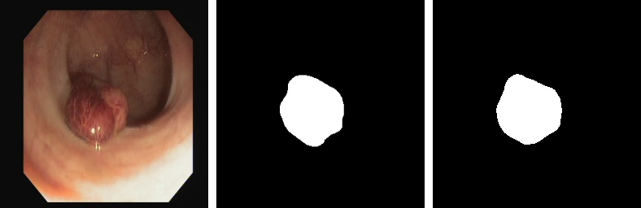
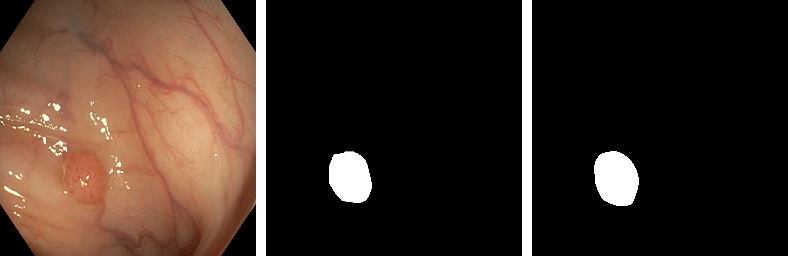
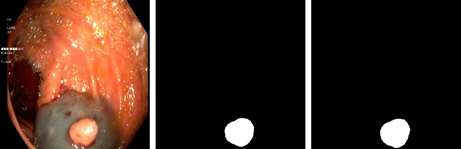
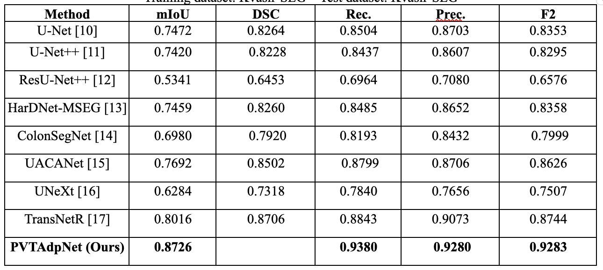
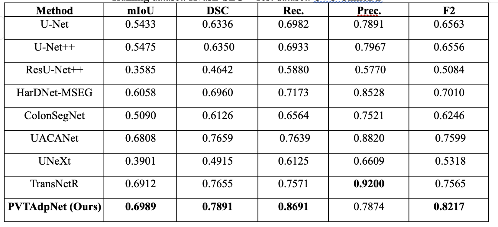

# PVTAdpNet

PVTAdpNet is an encoder decoder network with adapter layer which can be used for efficient biomedical image segmentation for both in-distribution and out-of-distribution datasets.

# model architecture


# installation
Our implementation has been tested and run on Python 3.10 using the libraries from requirements.txt.

To install the libraries you can run the command:

```pip install -r requirements.txt```

NOTE: You should be able to use slightly different versions for the libraries than the ones we used as long as they are compatible with one another.

We tested the model on machines using: Windows 10, Windows 11, and Linux Ubuntu 20.04 operating systems. We trained the model using both an NVIDIA RTX 3090 24GB VRAM and NVIDIA A100 40GB, so 24GB of VRAM should be enough to train the model.


# Dataset
The randomly split datasets we tested the models on are publicly available here.

The datasets used in this study are publicly available at:

- Kvasir-SEG: [here](https://datasets.simula.no/kvasir-seg/).
- CVC-ClinicDB: [here](https://polyp.grand-challenge.org/CVCClinicDB/).
- ETIS-LaribpolypDB: [here](https://drive.google.com/drive/folders/10QXjxBJqCf7PAXqbDvoceWmZ-qF07tFi?usp=sharing).
- CVC-ColonDB: [here](https://drive.google.com/drive/folders/1-gZUo1dgsdcWxSdXV9OAPmtGEbwZMfDY?usp=sharing).

# Results (Qualitative results)
Result of PVTAdpNet on Ksavir test data


Result of PVTAdpNet on CVC-Clinical test data


Result of PVTAdpNet on C1-PolypGen test data


Result of PVTAdpNet on C2-PolypGen test data


Result of PVTAdpNet on C3-PolypGen test data


# Results (Quantative results)
Quantitative results on the Kvasir-SEG test dataset.


Quantitative results on the CVC-Clinical test dataset.



